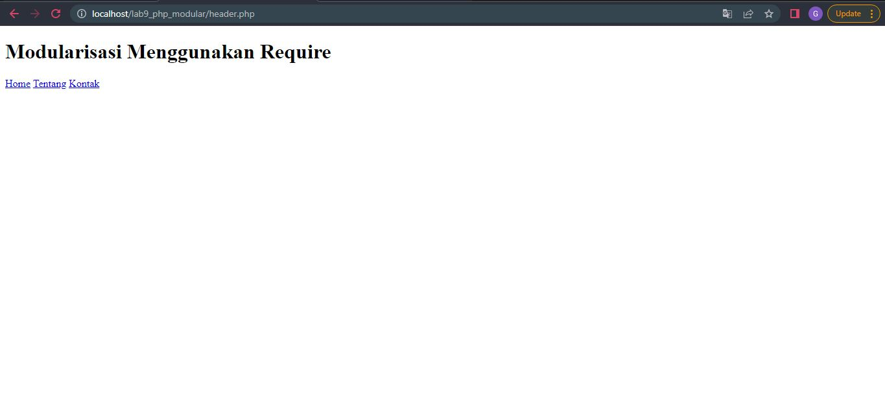
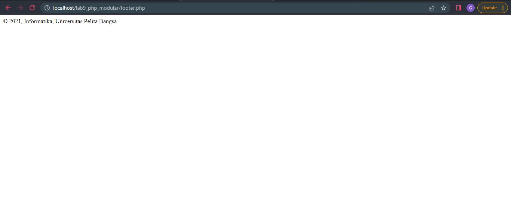
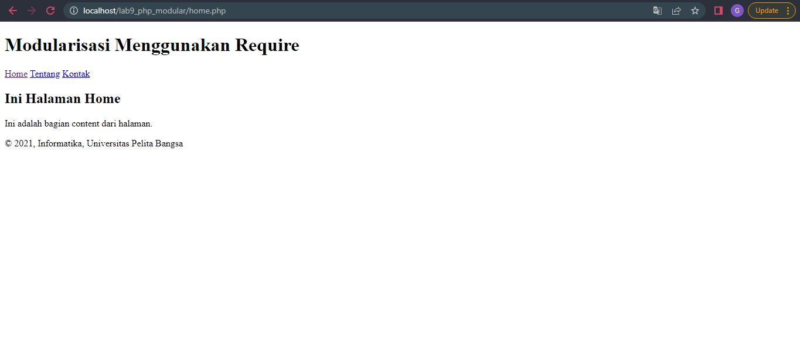
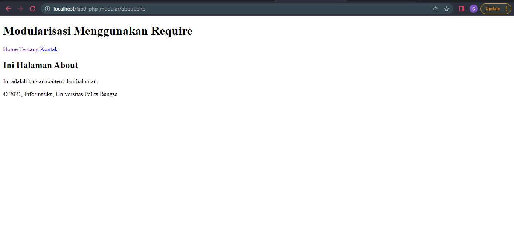
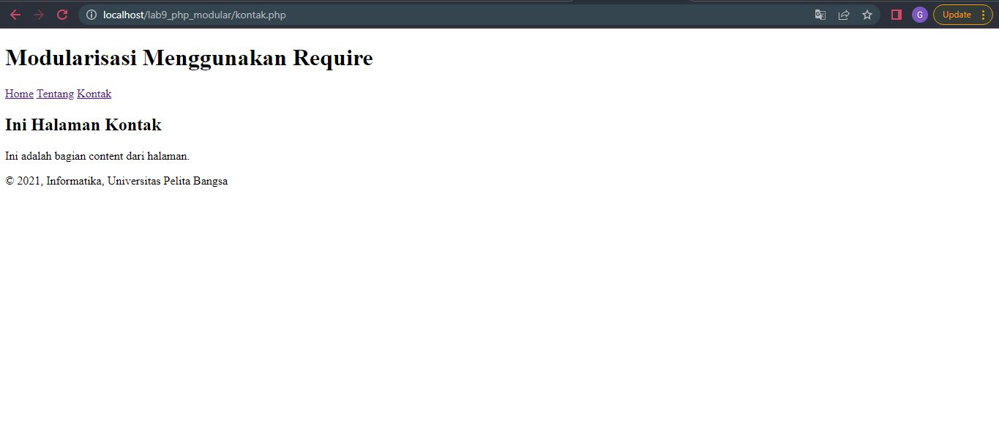

# Lab9web
## Memahami Modularisasi Program
Modularisasi adalah Pembuatan Program dibagi ke dalam beberapa modul.

### Membuat Header
Kemudian untuk mengakses hasilnya melalui URL: http://localhost/lab9_php_modular/header.php
Ini adalah tampilannya

### Membuat Footer
Kemudian untuk mengakses hasilnya melalui URL: http://localhost/lab9_php_modular/footer.php
Ini adalah tampilannya

### Membuat Halamanan Home
Kemudian untuk mengakses hasilnya melalui URL: http://localhost/lab9_php_modular/home.php
Ini adalah tampilannya

### Membuat Halaman About
Kemudian untuk mengakses hasilnya melalui URL: http://localhost/lab9_php_modular/about.php
Ini adalah tampilannya

### Membuat Halaman Kontak
Kemudian untuk mengakses hasilnya melalui URL: http://localhost/lab9_php_modular/kontak.php
Ini adalah tampilannya
